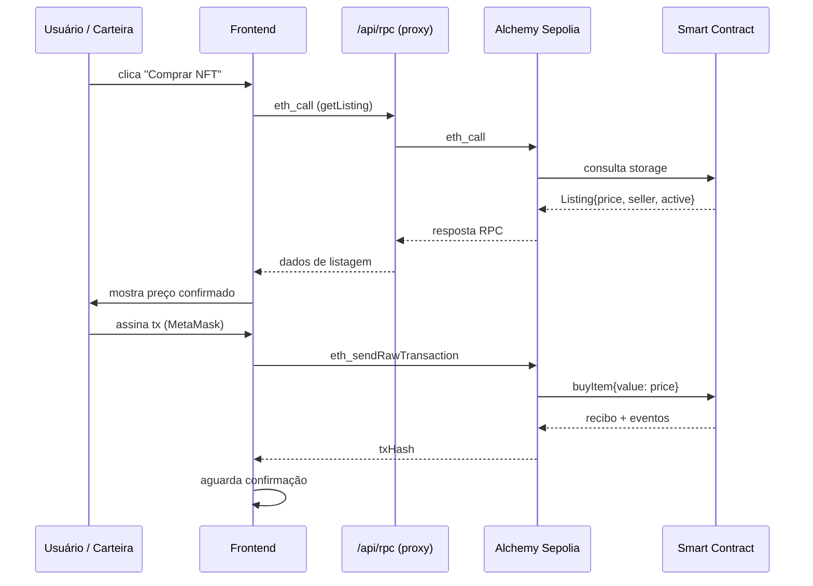
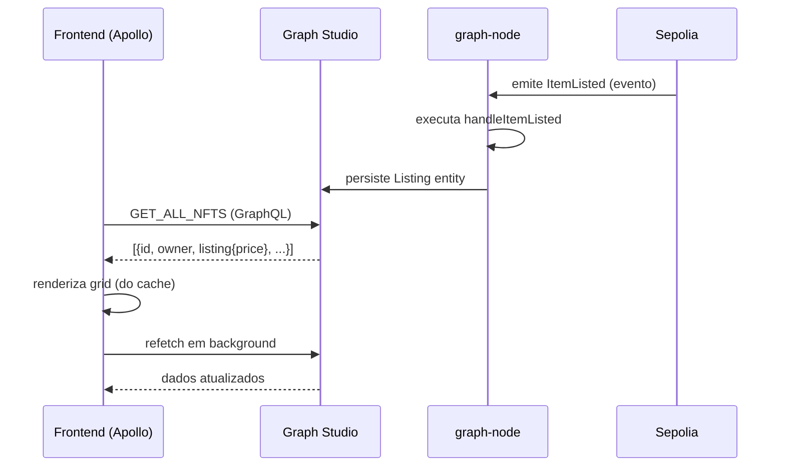

# 1. Arquitetura do Sistema

## 1.1 Visão em Camadas

O CryptoMint é organizado em três camadas independentes comunicando-se por
interfaces bem definidas:

```
┌─────────────────────────────────────────────────────┐
│                  Frontend (Next.js 16)               │
│  App Router · wagmi 3 · Apollo Client 4 · Tailwind  │
└───────────┬──────────────────┬───────────────────────┘
            │  GraphQL (HTTP)  │  JSON-RPC (HTTP proxy)
            ▼                  ▼
┌──────────────────┐  ┌─────────────────────────────────┐
│  The Graph       │  │  Ethereum Sepolia               │
│  Studio (Hosted) │  │  (via Alchemy RPC)              │
│  GraphQL API     │  │                                 │
└────────┬─────────┘  │  NFTMarketplace                 │
         │            │  NFTCollectionFactory           │
         │ indexa     │  NFTCollection (N instâncias)   │
         └────────────┴─────────────────────────────────┘
```

### Camada 1 — Blockchain (Smart Contracts)

Implementada em Solidity 0.8.20 com a toolchain **Foundry**. Contém toda a
lógica de negócio, custódia de ETH em escrow e transferência de NFTs. Uma vez
implantados, os contratos são **imutáveis** — não há proxy upgradeable.

### Camada 2 — Indexação (The Graph / Subgraph)

Um *subgraph* inscrito nos eventos dos contratos transforma logs da EVM em
entidades GraphQL estruturadas. Hospedado no Graph Studio (serviço gerenciado).
O frontend consulta essa camada para todas as operações de leitura não
críticas: listagens, coleções, atividade, estatísticas.

### Camada 3 — Frontend (Next.js 16)

Interface React com App Router. Conecta as duas camadas anteriores:

- **Apollo Client 4** → subgraph (GraphQL)
- **wagmi 3 + viem 2** → contratos Solidity (JSON-RPC, via proxy `/api/rpc`)
- **Alchemy NFT API** → metadados off-chain e imagens (via proxy `/api/alchemy/*`)
- **Pinata** → pinagem de imagens e metadados no IPFS (via `/api/upload*`)

Proxies server-side garantem que nenhuma chave de API chegue ao bundle do cliente.

## 1.2 Comunicação entre Camadas

### Frontend ↔ Blockchain (JSON-RPC)



### Frontend ↔ Subgraph (GraphQL)

O Apollo Client envia queries HTTP POST ao endpoint do Graph Studio. A política
`cache-and-network` renderiza imediatamente do cache e revalida em background.



### Subgraph ↔ Blockchain (Event Log Indexing)

O graph-node assina os eventos listados em `subgraph.yaml`. Para cada evento
confirmado, executa o handler AssemblyScript correspondente, que lê/cria/atualiza
entidades no banco de dados PostgreSQL interno. Templates dinâmicos permitem
indexar contratos de coleção criados em runtime pelo factory.

## 1.3 Padrões de Projeto Identificados

### On-chain (Smart Contracts)

| Padrão | Onde é aplicado |
|---|---|
| **Factory** | `NFTCollectionFactory.createCollection()` — deploya `new NFTCollection()` e mantém registry append-only |
| **Checks-Effects-Interactions (CEI)** | Todas as funções payable do marketplace (ex.: `buyItem` deleta o Listing antes de transferir ETH e NFT) |
| **Pull-payment fallback** | `pendingWithdrawals` mapping + `withdrawPending()` — evita DoS por receptor ETH malicioso |
| **Commit-reveal** | `commitMintSeed()` → `revealMintSeed()` — garante aleatoriedade auditável no mint |
| **ReentrancyGuard** | `nonReentrant` em toda função que move ETH ou NFT |
| **Struct packing** | `Listing` (2 slots) e `Offer` (2 slots) — reduz custo SLOAD/SSTORE |
| **O(1) swap-and-pop** | `_offerBuyerIndex` — remoção de compradores da lista sem iteração |
| **Custom errors** | 24 erros no marketplace, 16 na collection — mais baratos que `require(string)` |
| **Bounded-gas external call** | `staticcall` para `royaltyInfo` limitado a 30.000 gas + 64 bytes de retorno |

### Frontend

| Padrão | Onde é aplicado |
|---|---|
| **Provider pyramid** | `layout.tsx`: ThemeProvider → ApolloProvider → Web3Provider → ErrorBoundary |
| **Hooks como use-cases** | `useListNFT`, `useBuyNFT`, `useAcceptOffer` encapsulam mutations completas |
| **Two-step state machine** | `useTwoStepContractMutation` — 5 fases: idle → approve-wallet → approve-confirm → exec-wallet → exec-confirm |
| **`useSyncExternalStore`** | `useClock`, `useFavorites` — compartilha timer/store sem Context Provider |
| **Subgraph-first / RPC-fallback** | `useCollections`, `useNFTOffers`, `useCollectionDetails` — subgraph para pintura rápida, RPC para dados autoritativos |
| **Server-only secrets** | `src/lib/env.ts` — importado apenas pelo servidor; chaves Alchemy/Pinata nunca chegam ao bundle |
| **Suspense boundaries** | Navbar e rotas com dados assíncronos envoltos em `<Suspense>` |

## 1.4 Decisões Arquiteturais e Trade-offs

### Sem proxies upgradeable (imutabilidade)

**Decisão:** contratos implantados via `new` direto (sem EIP-1967/UUPS).

**Vantagem:** superfície de ataque menor — não há lógica de `delegatecall`, sem
risco de falha na inicialização ou colisão de storage.

**Trade-off:** qualquer bug pós-deploy exige novo contrato e migração manual.
Aceitável no contexto acadêmico; em produção real exigiria proxy upgradeable
ou mecanismo de pausa de emergência.

### Modelo fixed-price + ofertas (sem leilões)

**Decisão:** o marketplace suporta apenas listagem a preço fixo e ofertas
bilaterais com expiração de 7 dias.

**Vantagem:** contrato mais simples, menor superfície de bugs de timing e
manipulação de bloco.

**Trade-off:** criadores e colecionadores não podem realizar leilões à inglesa
ou holandesa — mecanismo de descoberta de preço menos eficiente.

### Graph Studio hospedado (sem self-hosted graph-node)

**Decisão:** o subgraph é implantado no serviço gerenciado Graph Studio em vez
de um graph-node local (que exigiria PostgreSQL + IPFS adicionais no compose).

**Vantagem:** zero operação de infraestrutura; o `docker-compose.yml` só
precisa do serviço `frontend`.

**Trade-off:** dependência de serviço externo; sem SLA garantido para o
ambiente acadêmico.

### Proxy `/api/rpc` para RPC da Sepolia

**Decisão:** toda chamada RPC do frontend passa por uma API Route Next.js
que injeta a chave Alchemy no servidor.

**Vantagem:** chave nunca exposta no bundle JavaScript do cliente.

**Trade-off:** latência extra de ~1 hop; rate-limiting na rota (120 req/min/IP)
pode bloquear usuários com uso intenso. Mitigável com Redis em produção.

### Sepolia em vez de mainnet

**Decisão:** rede de testes por toda a duração do projeto.

**Vantagem:** custo zero de gas; nenhum risco financeiro real.

**Trade-off:** Sepolia pode ter reorganizações de blocos mais frequentes e
blockhash menos imprevisível que a mainnet — a mecânica de aleatoriedade do
mint é menos robusta que em mainnet (conforme documentado como limitação).

---

[← Visão Geral](./00-visao-geral.md) | [Próximo: Backend →](./02-backend-solidity.md)
