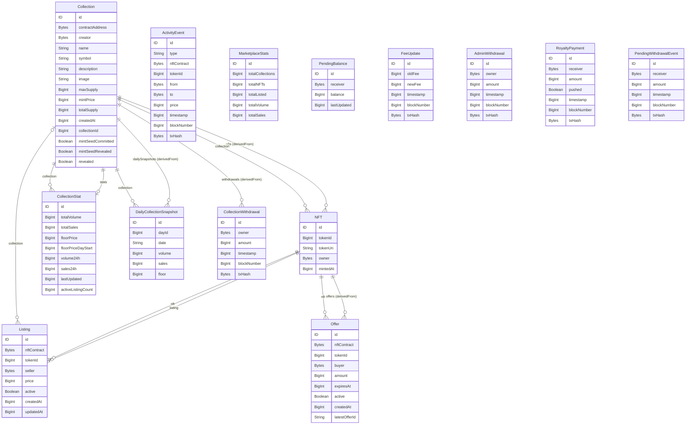

# 5. Modelagem de Dados

## 5.1 Fontes de Verdade

O sistema possui três camadas de persistência com papéis distintos:

| Camada | Persistência | Consistência | Autoridade sobre |
|---|---|---|---|
| **Smart contracts** (Solidity mappings) | Ethereum Sepolia (global, imutável) | Forte (consenso) | Preços, ownership, escrow, royalties |
| **Subgraph** (PostgreSQL gerenciado) | The Graph Studio | Eventual (segundos atrás) | Listas, agregações, atividade, stats |
| **IPFS** (via Pinata) | Content-addressed, distribuído | Forte (hash) | Metadados e mídias dos NFTs |
| **localStorage** (navegador) | Local por endereço | N/A | Favoritos do usuário |

## 5.2 Modelo On-chain (Solidity Storage)

Os contratos armazenam o estado mínimo necessário para executar a lógica de
negócio. Dados descritivos (nome da coleção, imagem) ficam on-chain como strings
para que indexadores possam lê-los, mas o conteúdo real vive no IPFS.

### Invariantes de storage do Marketplace

```
totalEscrow = address(this).balance
            - accumulatedFees
            - totalPendingWithdrawals
```

Garantia: o contrato nunca toca no ETH de escrow (ofertas em aberto) ao sacar
as taxas do marketplace. Verificado pelo teste
`test_withdraw_doesNotDrainEscrow` em `NFTMarketplace.t.sol:1003`.

## 5.3 Diagrama ER — Entidades do Subgraph



## 5.4 Detalhamento das Entidades

### `Collection`

- **ID:** hex do endereço do contrato (ex.: `0xabcd...`).
- Campos de metadados (`name`, `symbol`, `description`, `image`) lidos via
  `factory.try_getCollection(collectionId)` no handler `handleCollectionCreated`
  para evitar múltiplas chamadas ao nó.
- `mintSeedCommitted`, `mintSeedRevealed`, `revealed` evoluem via eventos
  `MintSeedCommitted`, `MintSeedRevealed`, `Revealed` do template dinâmico.

### `NFT`

- **ID:** `collectionAddr-tokenId` (ex.: `0xabcd...-42`).
- `owner` atualizado a cada `Transfer` (ERC-721 padrão), garantindo rastreio
  mesmo de transferências fora do marketplace.
- `listing` é FK opcional — `null` quando o NFT não está listado.

### `Listing`

- **ID:** `nftContract-tokenId` (composto). Como há apenas uma listagem ativa
  por NFT, o ID é simples e sobrescrito a cada nova listagem.
- `active: false` indica listagem histórica (vendida, cancelada ou invalidada
  por Transfer).
- `updatedAt` refletido em `ListingPriceUpdated`.

### `Offer`

- **Dual-ID pattern** (ver seção 3.6):
  - Canônico (`nftContract-tokenId-buyer`) — estado atual, sobrescrito.
  - Tx-único (`nftContract-tokenId-buyer-txHash`) — histórico imutável.
- `latestOfferId` no canônico aponta para o registro tx-único mais recente.
- `expiresAt` é Unix timestamp; o frontend computa o countdown via `useClock`.

### `ActivityEvent`

- Tipo `enum ActivityType`:
  `listing | listing_updated | listing_cancelled | sale | offer |
  offer_accepted | offer_cancelled | offer_expired_refund | mint | transfer`
- Registro unificado de toda atividade do marketplace, acessível via
  `GET_ACTIVITY_FEED` no frontend.

### `CollectionStat`

- `floorPrice` é `BigInt` **nullable** — anulado quando a listagem no floor é
  removida; restaurado no próximo `ItemListed`/`ListingPriceUpdated`.
- `volume24h` / `sales24h` resetados no início de cada dia (day ID = `timestamp / 86400`).
- `floorPriceDayStart` capturado no rollover diário como base para delta 24h.

### `PendingBalance`

- Reflete o ledger de pull-payment do `NFTMarketplace.pendingWithdrawals`.
- Creditado por `RoyaltyPending`, debitado por `PendingWithdrawn` (clamped a 0).

### Entidades imutáveis (`@entity(immutable: true)`)

`FeeUpdate`, `AdminWithdrawal`, `RoyaltyPayment`, `PendingWithdrawalEvent`,
`CollectionWithdrawal` são append-only — nunca atualizados após criação. O The
Graph aplica otimizações de storage para entidades imutáveis (sem MVCC overhead).

## 5.5 Estratégias de ID

| Padrão | Entidades que usam |
|---|---|
| Endereço hex | `Collection`, `CollectionStat`, `PendingBalance` |
| `txHash-logIndex` | `ActivityEvent`, `FeeUpdate`, `AdminWithdrawal`, `RoyaltyPayment`, `PendingWithdrawalEvent`, `CollectionWithdrawal` |
| `nftContract-tokenId` | `Listing`, `NFT` |
| `nftContract-tokenId-buyer` | `Offer` (canônico) |
| `nftContract-tokenId-buyer-txHash` | `Offer` (tx-único histórico) |
| `collectionAddr-dayId` | `DailyCollectionSnapshot` |
| `"global"` | `MarketplaceStats` (singleton) |

## 5.6 Modelo de Metadados IPFS

Cada NFT mintado tem sua URI no formato `ipfs://<CID>`. O JSON de metadados
segue o padrão ERC-721 Metadata:

```json
{
  "name": "Nome do NFT",
  "description": "Descrição",
  "image": "ipfs://<CID_da_imagem>"
}
```

- A imagem é pinada via `/api/upload` (Pinata).
- O JSON de metadados é pinado via `/api/upload-metadata`.
- O CID resultante é passado ao pool de URIs da coleção antes do mint.
- O frontend resolve `ipfs://` para HTTP via `resolveIpfsUrl(url, gatewayIndex)`
  em `src/lib/ipfs.ts`, com fallback entre múltiplos gateways.

---

[← Frontend](./04-frontend-nextjs.md) | [Próximo: Funcionalidades →](./06-funcionalidades.md)
