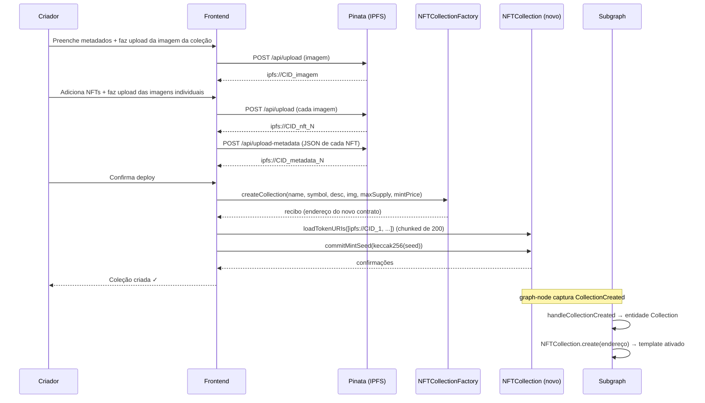
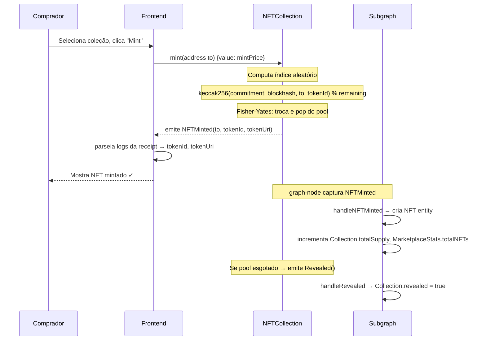
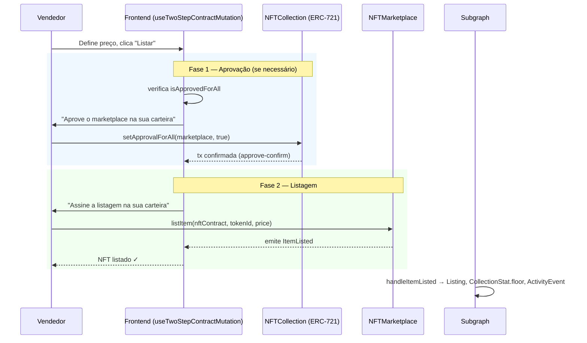
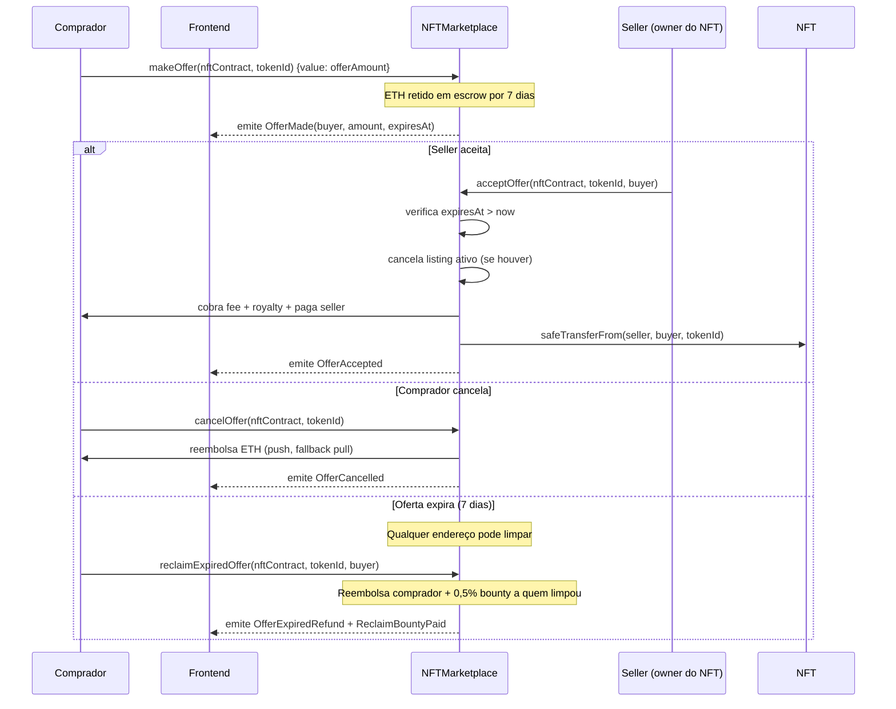
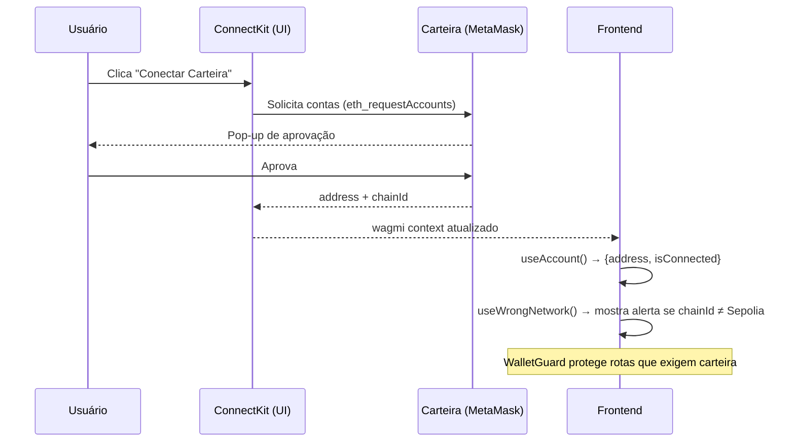

# 6. Funcionalidades Principais

## 6.1 Criação de Coleção

O criador passa por um wizard multi-step gerenciado por `useCollectionForm`
(reducer) na rota `/collections/create`.



**Chunks de 200 URIs** em `loadTokenURIs`: evita ultrapassar o limite de gas
por bloco ao fazer upload em lotes.

## 6.2 Mint Aleatório



Após o mint de toda a coleção, o criador chama `revealMintSeed(seed)`. O
contrato valida `keccak256(seed) == mintSeedCommitment` e registra a semente
publicamente para auditoria.

## 6.3 Listagem (Two-Step)



## 6.4 Compra a Preço Fixo

```mermaid
sequenceDiagram
    participant U as Comprador
    participant FE as Frontend
    participant MK as NFTMarketplace
    participant SEL as Vendedor
    participant ROY as Receptor de Royalty
    participant SG as Subgraph

    U->>FE: Clica "Comprar" no asset page
    FE->>MK: getListing(nftContract, tokenId)  [RPC — autoritativo]
    MK-->>FE: Listing{price, seller, active}

    U->>FE: Confirma preço
    U->>MK: buyItem(nftContract, tokenId) {value: price}

    Note over MK: CHECKS: ativo, msg.value == price, não é seller
    Note over MK: EFFECTS: listing.active = false; limpa ghost offer do comprador
    Note over MK: INTERACTIONS (por último):

    MK->>MK: _calculateFees → marketFee + royalty (cap 10%)
    MK->>SEL: _paySeller (push ETH, fallback pull)
    MK->>ROY: _payRoyalty (push ETH, fallback pull)
    MK->>NFT: safeTransferFrom(seller, comprador, tokenId)

    MK-->>FE: emite ItemSold
    FE-->>U: Compra confirmada ✓

    SG->>SG: handleItemSold → desativa Listing, atualiza NFT.owner
    SG->>SG: atualiza MarketplaceStats, CollectionStat, DailySnapshot, ActivityEvent
```

## 6.5 Ciclo de Oferta



### Limpeza em lote de ofertas expiradas

`pruneExpiredOffers(nftContract, tokenId, maxIterations)` itera sobre o array
de compradores, reembolsando cada oferta expirada com o bounty de 0,5% para o
chamador. `maxIterations = 0` significa sem limite.

## 6.6 Autenticação de Usuário

O sistema não possui login tradicional. A identidade é derivada da **carteira
Ethereum**:



### Upload autenticado (EIP-191)

Para uploads de mídia, o frontend exige que o usuário assine uma mensagem:

```
Upload autorizado por: {address}
Timestamp: {unix}
Expiração: 5 minutos
```

O servidor verifica a assinatura via `viem.recoverMessageAddress` e só processa
o upload se o endereço coincidir e o timestamp estiver dentro de 5 minutos.
Isso evita uploads anônimos sem exigir um sistema de sessão.

## 6.7 Favoritos

Favoritos são armazenados **exclusivamente no navegador** (sem backend):

```typescript
// src/hooks/user/useFavorites.ts (simplificado)
const key = `nft_favorites_${address.toLowerCase()}`;
// lê/escreve em localStorage
// sincroniza abas via StorageEvent
```

- `useIsFavorited(nftId)` — retorna booleano reativo.
- `useFavorite(nftId)` — toggle com atualização imediata do store.
- `useUserFavorites()` — lista os IDs favoritados e busca metadados via Alchemy.

O botão de favorito em `NFTCard` fica **fora** do `<Link>` que envolve o card,
evitando que o clique de favoritar navegue para o asset.

## 6.8 Activity Feed

```mermaid
sequenceDiagram
    participant FE as Frontend (useActivityFeed)
    participant SG as Subgraph
    participant BC as Blockchain

    loop A cada 30 segundos (POLL_ACTIVITY_MS)
        FE->>SG: GET_ACTIVITY_FEED (tipo, collection, page)
        SG-->>FE: [{type, from, to, price, txHash, timestamp}]
        FE->>FE: formata priceETH via formatEther
        FE-->>U: atualiza tabela / cards de atividade
    end

    Note over BC,SG: Cada evento on-chain vira ActivityEvent no subgraph
    Note over FE: Desktop: tabela; Mobile: cards empilhados
```

Filtros disponíveis: tipo de evento (listing, sale, offer, mint, transfer),
coleção específica.

---

[← Modelagem](./05-modelagem-dados.md) | [Próximo: Requisitos NF →](./07-requisitos-nao-funcionais.md)
